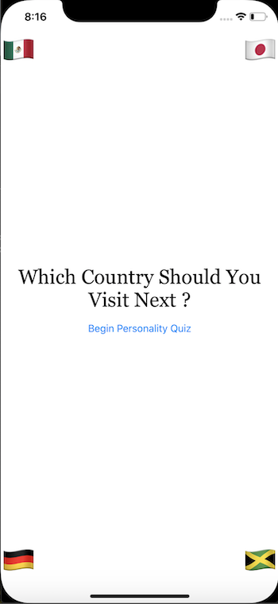
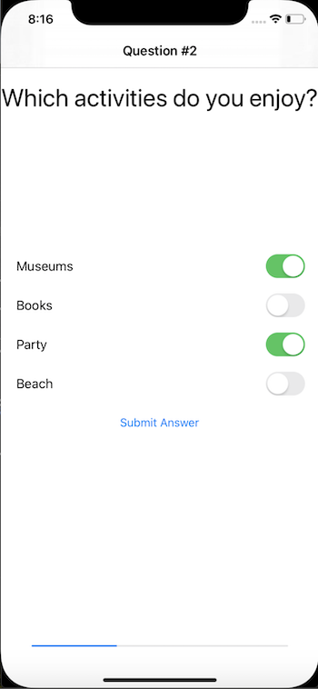
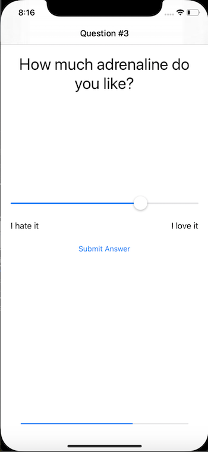
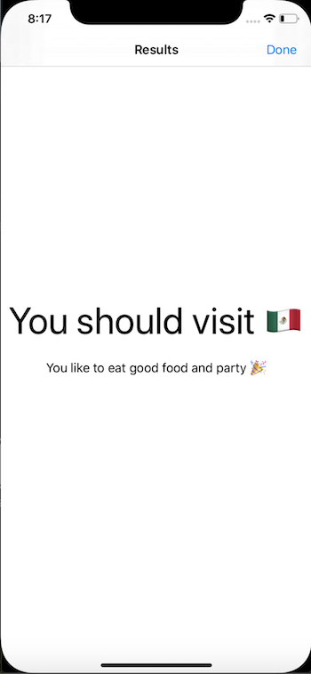
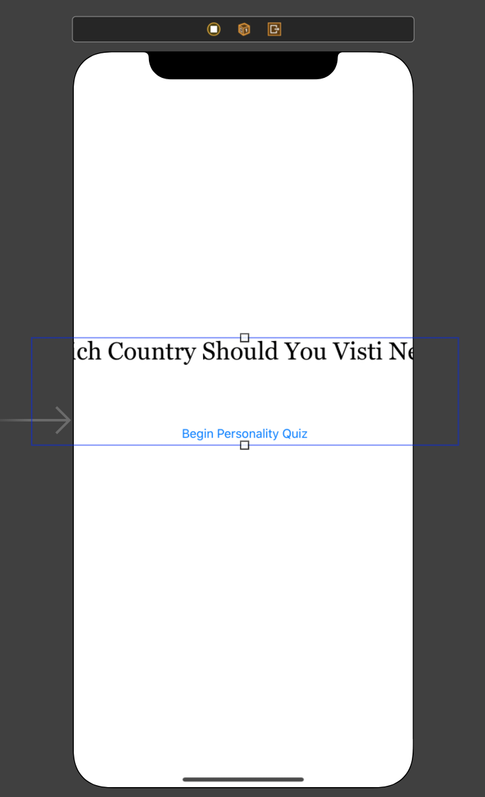
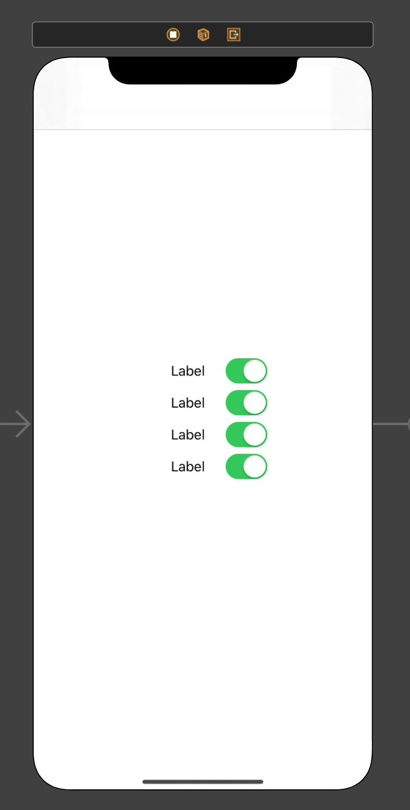

# AllAroundTheWorld

1. [Week 3](https://github.com/ECC-Laboratoria/AllAroundTheWorld/tree/master/Week3)
2. [Week 4](https://github.com/ECC-Laboratoria/AllAroundTheWorld/tree/master/Week4)


---


### 1. Preámbulo: Ciclo de vida de una app 


### 2. Overview del proyecto 

Para este segundo proyecto vamos a desarrollar un test de personalidad. La idea de este test es que nos de la respuesta a la siguiente pregunta: **¿Qué país deberías visitar en tus siguientes vacaciones?** Es decir, tenemos que diseñar nuestras propias preguntas y respuestas. 

**Ojo: el tema del proyecto depende completamente de ustedes, decidan qué tipo de test les gustaría diseñar. 

Antes de comenzar a programar, decidan el tema que quieren abordar. Para esta app, hay que desarrollar las siguientes tres secciones: 

1. **Mostrar** la pantalla de inicio del quiz. 
2. **Presentar** las preguntas y respuestas.
3. **Desplegar** los resultados.

Por esta razón, vamos a necesitar de al menos tres ViewControllers para construir nuestra app: un ViewController para cada sección. 

Dentro de la sección de preguntas, considera tres tipos de preguntas: 

	1. Única respuesta
 	2. Respuesta múltiple
 	3. Respuesta en un rango -> ¿Del 1 al 10, qué tanto te gusta ....?


​	 

​               

 





### 3. Objetivos del proyecto

1. **UIKit**: entender los conceptos de Auto Layout, UIStackViews, UINavigationControllers.
2. **Swift:**  entender los conceptos de Optionals, Class, Struct. 
3. **Computer Science**: entender los conceptos de la arquitectura Modelo Vista Controlador y ciclo de vida de una app. 
4. **Soft skills**: trabajar en equipo y fomentar la creatividad para solucionar el problema presentado en este proyecto. 

### 4. Consideraciones generales 

### 5. Entregables 

1. Link del repositorio en **Github** donde se encuentra el proyecto. 
2. Dentro del archivo **README.md** del repositorio, harás una descripción de tu app junto con screen shots de las vistas. Sean creativas en esta parte, contará como evaluación. Piensa en este archivo como un pitch de tu app donde el usuario será lo único que vea y con base en este archivo, el usuario decidirá si descarga tu app. 

### 6. Checklist 

#### **Setup**

1. Formen un squad de 4-5 integrantes y piensen en un nombre para su squad.
2. **Solo van a ocupar una computadora para programar** pues es muy importante que entre todas trabajen para cumplir el proyecto; la idea es que se vayan rotando entre todas las integrantes el trabajo de programar y diseñar interfaces. Las demás computadoras las ocuparán para revisar el código visto en clase e investigar temas extra. 
3. Dentro de la computadora elegida, creen un nuevo repositorio en Github y llámenlo **PersonalityQuiz**. Al crearlo, indiquen a Github que quieren inicializar el repositorio con un archivo **README.md**. Dentro de este archivo, enlisten el nombre de todas las integrandes del squad. 
4. Clonen ese repositorio dentro del escritorio. 

#### **Xcode**

1. Creen un nuevo proyecto y seleccionen la opción **Single View App**. 
2. Para la opción de Product Name: **PersonalityQuiz-ECC**. 
3. Team: None 
4. Organization Team: nombre de su squad. 
5. Organization Identifier: com.example
6. Language: Swift 
7. User Interface: Storyboard
8. Deseleccionen Use Core Data, Include Unit Tests, Include UI Tests 
9. Guarden el proyecto dentro de la carpeta del repositorio que clonaron en el escritorio. **Asegúrense** de deseleccionar la opción **Create Git repository on my Mac**. 

#### **Planeación**

#### **UI**

1. Abre ```Main.storyboard``` y agrega dos ViewControllers extra. Para hacer esto, necesitas abrir el menú (Object Library) con todos los componentes de UIKit. 

   

2. El primer ViewController servirá como la vista de introducción. Como elementos básicos, necesitarás un **label** para el título y un **botón** para comenzar el quiz. 

   1. Agrega un UILabel a la vista. 
      1. Texto del UILabel: **Which Country Should You Visit Next?**
      2. Fuente: **Georgia**
      3. Tamaño: **30**
   2. Agrega un UIButton a la vista:
      1. Título del UIButton: **Begin Personality Quiz**
      2. Tamaño: **15**

   

3. Es buena idea usar un UIStackView aquí pues tenemos dos elementos alineados de manera vertical. Mete a los dos elementos (UILabel y UIButton) que creaste en el punto anterior dentro de un UIStackView. 

   1. Selecciona los dos elementos y da click en el ícono en la parte inferior derecha con una flecha apuntando hacía abajo dentro de un cuadrado y selecciona **StackView**. 

      

   2. Axis: **Vertical**

   3. Distribution y Alignment: **Fill**

   

4. Usando constraints, alínea el stack view en el centro de la pantalla: 

   

   

5. Ahora, hay que alinear el StackView para que tenga el mismo ancho que el Safe Area: 

   1. Desde el Document Outline, arrastra manteniendo la tecla control presionada, el **Stack View** al **Safe Area**.

   2. Selecciona **Equal Widths**

      

      

   

6. Finalmente, para que el label se ajuste correctamente selecciona el label y dentro del inspecto de atributos:

   1. Number of Lines: **0**
   2. Line Break: **Word Wrap**

   

7. Agrega emojis dentro de labels en las esquinas y usa Auto Layour para dejarlas fijas en las cuatro esquinas: 

   

8. Ahora, comenzemos a trabajar con el botón. Control + arrastra desde el botón al segundo view controller.

   1. Selecciona **Present Modally**

   

   1. Da click en el **segue** (flecha que conecta el primer y segundo ViewController) y en el inspector de atributos en la sección de **Presentation** selecciona **Full Screen**

      

9. Ahora, hay que invocar un segue programático. 

   1. Control + arrastra desde el círculo amarillo con un cuadrado blanco (barra de arriba del ViewController) del segundo ViewController a la vista del tercer ViewController y selecciona **show**. 
   2. Dale click al segue y:
      1. Identifier: **ResultsSegue**

10. Selecciona el segundo ViewController y haz los siguientes pasos: 

    1. **Editor > Embed In > Navigation Controller**

       

11. Crea la interfaz de resultados:

    1. Desde la librería de Objetos, arrastra un **Navigation Item** al Navigation Bar del tercer ViewController:

       1. Cambia **Title** por **Results** en el inspector de atributos. 

    2. Desde la librería de Objetos, arrastra un **Bar Button Item** al lado derecho del Navigation Bar del tercer ViewController:

       1. System Item: **Done**

       

    3. Crea un StackView vertical con dos labels. 

       1. Usa la herramienta de Alineación para alinear el stack view verticalmente.
       2. Usa la herramienta de Add New Constraints para establecer **leading** y **trailing** a 0.
       3. Pon el número de letra del label de arriba en 50 puntos y 17 puntos para el label de abajo. 
       4. Alignment: **Center**
       5. Para el segundo label:
          1. Number of lines: **0**
          2. Line Break: **Word Wrap**

    

12. Dentro de la fase de planeación consideraste tres tipos de preguntas. Dentro del segundo ViewController haz lo siguiente: 

    1. Arrastra un vertical Stack View a la vista y agrega cuatro botones al stack view.  

       1. Spacing: **20**

    2. Usando la herramienta de Align:

       1. Centra el stack view verticalmente 

    3. Usando la herramienta de Add New Constraints:

       1. Leading edges: **20 px**

       

    4. Selecciona el stack view y deselecciona en el inspector de atributos la opción de **Installed** hasta abajo del menú. 

    5. Agrega un label y un switch de la librería de objetos y mételos dentro de un stack view horizontal. 

       1. Alignment y Distribution: **Fill**

    6. Duplica el stack view anterior otras tres veces 

       

    7. Mete a esos cuatro stack views dentro de otro stack view:

       1. Axis: **Vertical**
       2. Alignment y Distribution: **Fill**
       3. Spacing: **20**

    8. Agrega un botón al centro de la vista y llámalo **Submit Answer**

    9. Usa la herramienta de Align para centrar verticalmente el stack view 

    10. Usa la herramienta de Add New Constraints y:

        1. Trailing edges: **20**
        2. Leading edges: **20**

        

    11. De nuevo, deseleccionla la opción de **Installed** para este stack view. 

    12. Agrega dos labels de la librería de objetos a la vista y mételos dentro de un stack view:

        1. Axis: **Horizontal**
        2. Alignment: **Fill**
        3. Distribution: **Equal Spacing**

    13. Agrega un slider a la vista (por arriba del stack view anterior)

    14. Selecciona el slider y el horizontal stack view y mételos dentro de un stack view:

        1. Axis: **Vertical**
        2. Distribution y Alignment: **Fill**
        3. Spacing: **20**

    15. Agrega un buton hasta abajo del stack view:

        1. Título: **Submit Answer**

    16. Usa la herramienta de Align para centrar verticalmente el stack view 

    17. Usa la herramienta de Add New Constraints y:

        1. Trailing edges: **20**
        2. Leading edges: **20**

        

    18. Finalmente, selecciona la opción de **Installed** para los primeros dos stack views. 

    19. Agrega un label hasta arriba de la vista

        1. Tamaño: **32**
        2. Alignment: **Centered**
        3. Lines: **0**
        4. Line break: **Word Wrap**

    20. Usa la herramienta de Add New Constraints y:

        1. Trailing edges: **0**
        2. Leading edges: **0**
        3. Top edges: **20**

        

    21. Agrega un **Progress View**

        1. Usa la herramienta de Add New Constraints y:
           1. Trailing edges: **20**
           2. Leading edges: **20**
           3. Bottom edges: **20**


#### **Swift**

1. Una vez que tienen los tres ViewControllers en el Storyboard, hay que crear tres clases. 

   1. File > New > File 

      1. Cocoa Touch Class

         

      2. Class: QuestionViewController

         

      3. Repite los pasos anteriores pero ahora crea una nueva clase llamada **ResultsViewController** y cambia el nombre de ```ViewController.swift``` por **IntroductionViewController.swift**. 

         

2. Dentro de ```Main.storyboard``` selecciona cada ViewController y abre el inspector de clases para asignarle su clase correspondiente: [Repite este paso para los otros dos ViewControllers]

   

3. Ahora pasaremos a diseñar las estructuras que modelarán nuestra app. 

   1. File > New > File 
   2. Swift file 
   3. Save As: **Question**
   4. Repite el paso anterior pero ahora para un archivo llamado **Answer**

4. **Question.swift**

   

5. **Answer.swift**

   

6. Dentro de **QuestionViewControllwer.swift**

   1. Crea un arreglo de preguntas dentro de una variable llamada ```questions```. Cada pregunta deberá ser de uno de los tres tipos definidos. El texto de las preguntas irá definiendo la personalidad de tu usuario. 
   2. Agrega una propiedad llamada ```questionIndex``` e inicializalo en 0. 
   3. Crea tres **IBOutlets**, uno para cada stack view:
      1. ```singleStackView```
      2. ```multipleStackView```
      3. ```rangedStackView```
   4. Crea un método llamado ```updateUI```  y llámalo desde en ```viewDidLoad```: 
      1. Esconde los tres stack views: ```stackView.isHidden = true```
      2. Pon el título del navigation bar según la variable ```questionIndex```: ```navigationItem.title ="Question #\(questionIndex + 1)"``` 
      3. Declara una constante que acceda a la variable ```questions``` en la casilla ```questionIndex```. 
      4. Utiliza un ```switch``` para el tipo de pregunta y haz que aparezca en la vista según el tipo de pregunta. 

   

7. Ahora, crea outlets para cada uno de los elementos de los tres stack views (probablemente te sea más fácil arrastrar desde el document outline en lugar desde la vista): 

   1. 1 para el label de hasta arriba: ```questionLabel```
   2. 4 botones para el ```singleStackView``` 
   3. 4 labels para el ```multipleStackView```
   4. 2 labels para para el ```rangedStackView``` 
   5. 1 outlet para el ```progressView```

8. Actualiza el valor de ```questionLabel``` con ```currentQuestion.text``` 

9. Para ```questionProgressView```:

   1. ```let totalProgress = Float(questionIndex) / Float(questions.count) ```
   2. ```questionProgressView.setProgress(totalProgress, animated: true)``` 

10. Crea una constante: ```let currentAnswers = currentQuestion.answers``` 

11. Crea las siguientes funciones: 

    1. ```swift
       func updateSingleStack(using answers: [Answer]) {
               singleStackView.isHidden = false
               singleButton1.setTitle(answers[0].text, for: .normal)
               singleButton2.setTitle(answers[1].text, for: .normal)
               singleButton3.setTitle(answers[2].text, for: .normal)
               singleButton4.setTitle(answers[3].text, for: .normal)
           }
       ```

       ```swift
       func updateMultipleStack(using answers: [Answer]) {
               multipleStackView.isHidden = false
       			  multiSwitch1.isOn = false
               multiSwitch2.isOn = false
               multiSwitch3.isOn = false
               multiSwitch4.isOn = false
               multiLabel1.text = answers[0].text
               multiLabel2.text = answers[1].text
               multiLabel3.text = answers[2].text
               multiLabel4.text = answers[3].text
           }
       ```

       ```swift
       func updateRangedStack(using answers: [Answer]) {
               rangedStackView.isHidden = false
       			  rangedSlider.setValue(0.5, animated: false)
               rangedLabel1.text = answers.first?.text
               rangedLabel2.text = answers.last?.text
           }
       ```

12. Manda a llamar cada una de las funciones dentro de los casos del switch.

13. Crea la siguiente variable: ```var answersChosen: [Answer] = []```

14. Conecta los 4 botones del single stack view con una conexión tipo **IBAction**

15. Crea una función **IBAction** y conéctala con los 4 botones del single stack view. 

    ```swift
    @IBAction func singleAnswerButtonClicked(_ sender: UIButton) {
            let currentAnswers = questions[questionIndex].answers
            switch sender {
            case singleButton1:
                answersChosen.append(currentAnswers[0])
            case singleButton2:
                answersChosen.append(currentAnswers[1])
            case singleButton3:
                answersChosen.append(currentAnswers[2])
            case singleButton4:
                answersChosen.append(currentAnswers[3])
            default:
                break
            }
            nextQuestion()
        }
    ```

16. Crea 4 outlets para los switches del multi stack view

17. Crea una conexión de tipo **IBAction** para el botón ```Submit Answer``` del multi stack view:

    ```swift
    @IBAction func multipleAnswerButtonClicked(_ sender: Any) {
            let currentAnswers = questions[questionIndex].answers
            if multiSwitch1.isOn {
                answersChosen.append(currentAnswers[0])
            }
            if multiSwitch2.isOn {
                answersChosen.append(currentAnswers[1])
            }
            if multiSwitch3.isOn {
                answersChosen.append(currentAnswers[2])
            }
            if multiSwitch4.isOn {
                answersChosen.append(currentAnswers[3])
            }
            nextQuestion()
        }
    ```

18. Crea un **IBOutlet** para el slider del ranged stack view 

19. Agrega una conexión de tipo **IBAction** para el botón del ranged stack view:

    ```swift
    @IBAction func rangedAnswerButtonClicked(_ sender: Any) {
            let currentAnswers = questions[questionIndex].answers
            let index = Int(round(rangedSlider.value * Float(currentAnswers.count - 1)))
            answersChosen.append(currentAnswers[index])
            nextQuestion()
        }
    ```

20. Agrega la siguiente función:

    1. ```swift
       func nextQuestion() {
               questionIndex += 1
               if questionIndex < questions.count {
                   updateUI()
               } else {
                   performSegue(withIdentifier: "ResultsSegue", sender: nil)
               }
           }
       ```

21. Agrega la variable ```responses``` al **ResultsViewController** pues es donde recibiremos las respuestas del usuario en **QuestionsViewController**

    ```swift
    var responses: [Answer]!
    ```

22. Para pasar la información, hay que implementar el método ```prepare(for segue)``` dentro de **QuestionsViewController**:

    ```swift
    override func prepare(for segue: UIStoryboardSegue, sender: Any?) {
            if segue.identifier == "ResultsSegue" {
                let resultsViewController = segue.destination as! ResultsViewController
                resultsViewController.responses = answersChosen
            }
        }
    ```

23. Agrega los siguientes outlets a **ResultsViewController**:

    1. Uno para el label de 50 puntos -> ```resultsAnswerLabel```
    2. Uno para el label de 17 puntos -> ```resultDefinitionLabel```

24. Agrega las siguientes líneas en el método ```viewDidLoad()``` de **ResultsViewController**:

    ```swift
    calculatePersonalityResult()
    navigationItem.hidesBackButton = true
    ```

25. Y la función: 

    ```swift
    func calculatePersonalityResult() {
            var frequencyOfAnswers: [Type: Int] = [:]
            let responsesType = responses.map { $0.type }
            for response in responsesType {
                frequencyOfAnswers[response] = (frequencyOfAnswers[response] ?? 0) + 1
            }
            let mostCommonAnswer = frequencyOfAnswers.sorted { $0.1 > $1.1}.first!.key
            resultAnswerLabel.text = "You should visit \(mostCommonAnswer.rawValue)"
            resultDefinitionLabel.text = mostCommonAnswer.definition
    }
    ```

26. Finalmente, para poder regresar al principio agrega el siguiente método en **IntroductionViewController** y control + arrastra el botón ```Done```  hacía el ícono de salida y selecciona ```unwindToQuizIntroduction``` 

    ```swift
    @IBAction func unwindToQuizIntroduction(segue: UIStoryboardSegue) {}
    ```

### 7. Hacker Edition 

	1. Agrega más quizes y deja que el usuario elija desde la pantall de introducción.
 	2. Presenta las preguntas en un orden aleatorio. 

### 8. Pistas, tips y lecturas complementarias

- App Development with Swift: https://books.apple.com/us/book/app-development-with-swift/id1219117996

- The Swift Programing Guide: https://books.apple.com/us/book/the-swift-programming-language-swift-5-0/id881256329